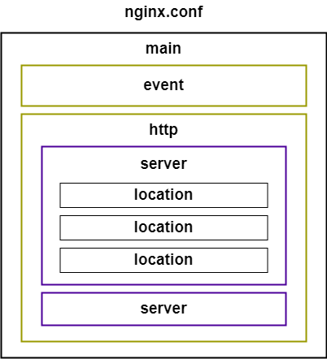

# Học nginx

### Cấu trúc file cấu hình



- Chia thành các block. Mỗi block nằm trong 1 cặp "{}".
- Có tính thừa kế. Các sub section có thể thừa kế của section cha.
- Mỗi session có một vai trò khác nhau:
  - **main**: Global setting.
  - **server**: Host settings.
  - **location**: The UTL matches the settings for a particular location.

_(\*) vhost: trên cùng 1 webserver có thể có nhiều domain khác nhau._

## Phân tích server section

Một config cơ bản sẽ có cấu trúc như sau:

```sh
server {
    # cổng lắng nghe request từ người dùng.
    listen 80; 
    # listen 80 default_server; sử dụng default_server nếu muốn server_name là này default. (Áp dụng trong trường hợp có nhiều server_name chạy chung 1 host và port)

    # Thư mục chứa source code front ent
    root /var/www/html;

    # URL sẽ đưọc truy cập từ trình duyệt. 
    server_name site1.local;

    # [Option] Thêm một trường vào header của request
    add-header key_A value_A;

    # TO-DO: ...
    location / {
        try_files $uri $uri/ =404;
    }
}
```

## Cấu trúc cây thư mục
Đây là cấu trúc cây thư mục của nginx.
```sh
root@quanpc:/etc/nginx# ls
conf.d        fastcgi_params  koi-win     modules-available  nginx.conf    scgi_params      sites-enabled  uwsgi_params
fastcgi.conf  koi-utf         mime.types  modules-enabled    proxy_params  sites-available  snippets       win-utf
```

Ở đây ta cần lưu ý các thư mục __*-available__ và __*-enabled__. 
- __*-available__: Chứa các file do người dùng tạo ra.
- __*-enabled__: Chứa các file mặc định hệ thống tạo ra. Thông thường trong các config ở đây sẽ gọi sang các config từ __*-available__. 

Để gọi __*-available__ từ __*-enabled__ ta sửa file **nginx.conf** thêm dòng sau:
```sh
include /etc/nginx/sites-available/*;
```
